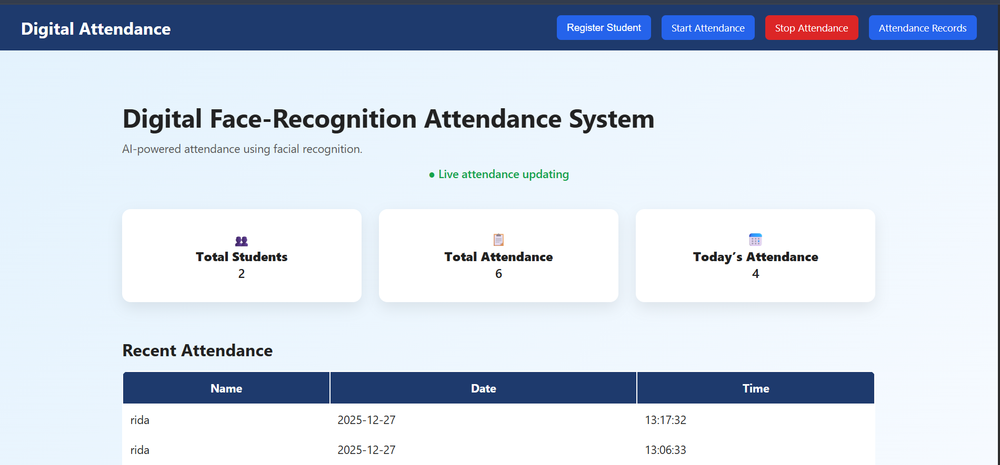

# Face Recognition Attendance System

A web-based attendance system using computer vision and facial recognition.

## Features
- Face-based student registration via webcam
- Real-time attendance marking
- Flask web dashboard
- Start / Stop attendance control
- Near real-time UI updates

## Tech Stack
- Python
- OpenCV
- face_recognition
- Flask
- HTML / CSS / JavaScript

## Setup
```bash
pip install -r requirements.txt
python app.py
